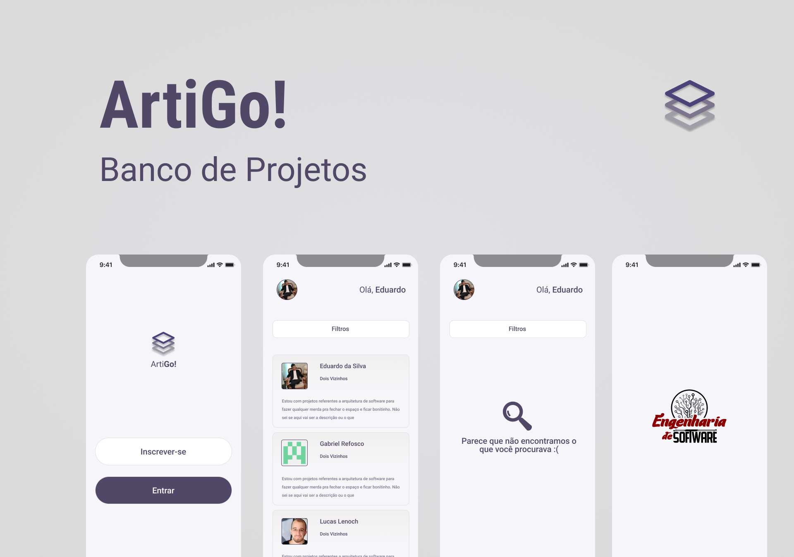

<h1 style="color: #F5F5FA">projektOrdner</h1>
Repositório referente ao trabalho do Banco de projetos, desenvolvido na matéria de Programação para dispositivos móveis, no curso de Engenharia de Software - UTFPR
<h1 style="color: #F5F5FA">Como rodar o projeto</h1>
Para abrir o app, façam assim:
<ul>
    <li style="font-style: italic">yarn start</li>
    <li>Dai abre outro terminal e roda o:</li>
    <li style="font-style: italic">yarn android</li>
    <li>(vai ficar rodando os 2 comandos em paralelo, dai interage com o app através terminal do "yarn android")
O "yarn android" precisa que tu tenha as variaveis de ambiente configuradas com o ANDROID_HOME, com o SDK do emulador.</li>
</ul>

